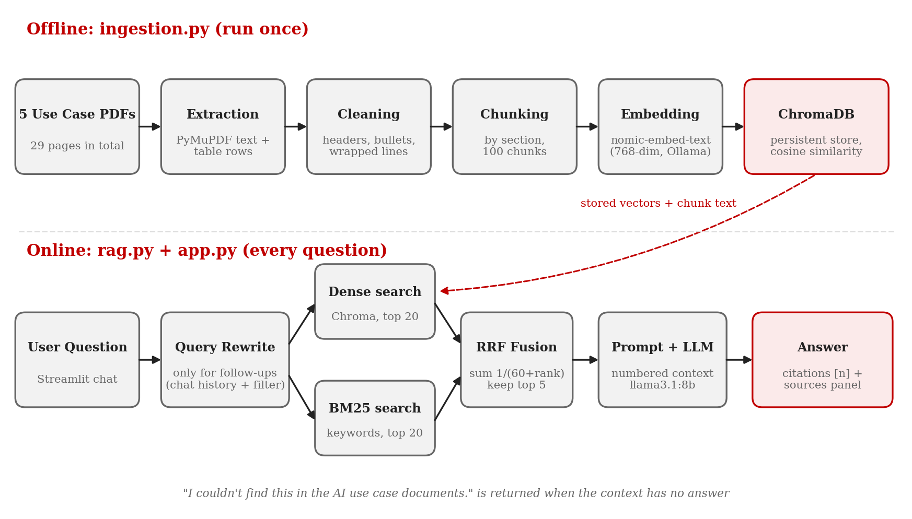

# AI Use Case Q&A using RAG (LangChain + ChromaDB + Ollama + Streamlit)

A question answering system over the 5 KJSSE AI use case PDFs. Everything runs locally: no API key, no internet after setup.

```
RAG_Pipeline/
├── data/               the 5 use case PDFs (source of the RAG)
├── config.py           model names, paths, chunk size, top-k (shared by all files)
├── check_setup.py      Step 1 check
├── ingestion.py        Step 2: PDF -> clean -> section chunks -> embeddings -> ChromaDB
├── rag.py              Step 3: retrieval (dense / BM25 / hybrid) + Ollama LLM with citations
├── app.py              Step 4: Streamlit chat UI
├── eval.py             Step 5: evaluation, results saved to results/
├── docs/               project report + architecture diagram
└── requirements.txt
```

## Architecture



## Results (25 question test set, llama3.1:8b + nomic-embed-text)

| Retrieval mode | Hit@1 | Hit@3 | Hit@5 | MRR@5 |
|---|---|---|---|---|
| Dense | 0.773 | 0.909 | 0.909 | 0.833 |
| BM25 | 0.773 | 0.818 | 0.909 | 0.814 |
| Hybrid (RRF, used in the app) | 0.727 | 0.818 | 0.955 | 0.802 |

Section-aware chunking beat naive fixed-size chunking (Hit@1 0.773 vs 0.545). With hybrid retrieval the answers had a keyword recall of 0.932, 3 of 3 out-of-scope questions were refused, and 21 of 22 answers carried citations. The full write-up is in `docs/AI_MiniProject_RAG_Report.docx`.

**Do the steps in order. Every step ends with a ✅ Check. Don't start the next step until the check passes.**

---

## Step 1: Setup (Python, Ollama, VS Code, packages)

**1.1 Install Python 3.12** from python.org. On Windows, tick **"Add python.exe to PATH"** in the installer.

> **Python 3.14 does not work.** ChromaDB depends on a package (`overrides`) that breaks on 3.14 (`typing.ByteString` was removed). If you already have 3.14, keep it and install 3.12 alongside it. The `py -3.12` command below picks the right one.

**1.2 Install Ollama** from https://ollama.com/download. On Windows and Mac it runs in the background after install (llama icon in the tray / menu bar).

**1.3 Pull the two models** (in any terminal):
```bash
ollama pull nomic-embed-text      # embedding model, ~270 MB
ollama pull llama3.2:3b           # LLM, ~2 GB
```
> **Pick the LLM by your RAM:** 8 GB RAM → `llama3.2:3b` (default). 16 GB+ or an NVIDIA GPU → `llama3.1:8b` or `qwen2.5:7b` give better answers. If you use another model, change `LLM_MODEL` in `config.py`.

**1.4 Open the project in VS Code:** `git clone https://github.com/CLCelestial/RAG_Pipeline.git`, then *File → Open Folder → RAG_Pipeline*. Install the **Python** extension if VS Code asks for it. Open a terminal with *Terminal → New Terminal*.

**1.5 Create and activate a virtual environment:**

Windows (PowerShell):
```powershell
py -3.12 -m venv .venv
.venv\Scripts\Activate.ps1
```
> If PowerShell says *"running scripts is disabled"*, run `Set-ExecutionPolicy -Scope CurrentUser RemoteSigned` once, then activate again.

Mac / Linux:
```bash
python3.12 -m venv .venv
source .venv/bin/activate
```
You should now see `(.venv)` at the start of the terminal line. In VS Code press `Ctrl+Shift+P` → **Python: Select Interpreter** → pick the `.venv` one.

**1.6 Install packages:**
```bash
pip install -r requirements.txt
```

### ✅ Check 1
```bash
ollama list
python check_setup.py
```
`ollama list` should show both models. `check_setup.py` should end with:
```
  OK    KJS-AGR-01  (KJS-AGR-01_Use_Case_-_Dr._Shyamal.pdf)
  ...
  OK    KJS-SRS-01: 7 pages, 15518 characters of text extracted

ALL CHECKS PASSED - go to Step 2 (python ingestion.py --preview)
```
It checks Python, all packages, that Ollama is running with both models, and that all **5 PDFs** are in `data/` with readable text.

---

## Step 2: Ingestion (PDFs → ChromaDB)

What `ingestion.py` does:
1. Reads each PDF with PyMuPDF. Tables (the AI Governance table, the sugarcane workflow table) are read separately so each row stays together, e.g. `Privacy & Data Protection (Relevance: High): ...`.
2. Cleans the text: removes the repeated page header and the "Page x of y" footer, fixes bullet symbols, joins lines the PDF had wrapped.
3. Splits each document into its numbered sections (Problem Statement, Objectives, ...). The small ones (ID, title, faculty, beneficiaries, dataset) go into one **Overview** chunk per use case. Long sections are split into ~900 character pieces with 150 overlap.
4. Adds a header line to every chunk, `[KJS-CES-02 | <title> | Section: Objectives]`, and stores metadata (use case id, section, pages, file).
5. Embeds the chunks with `nomic-embed-text` through Ollama and saves them in `chroma_db/` (cosine similarity).

First look at the chunks without embedding anything:
```bash
python ingestion.py --preview
```
Then build the vector store:
```bash
python ingestion.py
```

### ✅ Check 2
`--preview` shows all 5 use cases with 13-15 sections each and around **100 chunks** in total, plus a sample governance chunk with `(Relevance: High)` in it. The full run should end with:
```
Embedding with Ollama 'nomic-embed-text' ...
Stored 100 chunks in ...\chroma_db (xx.xs)
```
and a `chroma_db` folder appears. Re-running is safe because it rebuilds from scratch, so you won't get duplicate chunks.

---

## Step 3: RAG pipeline (retrieval + LLM)

What `rag.py` does:
* **Dense retrieval** (Chroma): matches by meaning.
* **BM25** (keyword): good with exact terms like `21700`, `M17`, `DPDP`, `GRD`.
* **Hybrid** (default): merges both lists using Reciprocal Rank Fusion, `score = Σ 1/(60 + rank)`.
* The top 5 chunks go into the prompt as numbered blocks. The LLM must answer only from them, cite `[1]`, `[2]`, and say *"I couldn't find this in the AI use case documents."* when the answer isn't there.
* Follow-up questions ("what about its challenges?") are first rewritten into a standalone question using the chat history.
* `num_ctx` is set to 8192 because Ollama's default context window is small and would silently cut off the retrieved chunks.

```bash
python rag.py "What Reynolds number range is used in the CFD simulations?"
python rag.py "Who won the FIFA World Cup in 2022?"
python rag.py            # interactive mode with chat history, type exit to quit
```

### ✅ Check 3
* The first answer mentions **400–700**, has a citation like `[1]`, and the sources list shows **KJS-CES-02**.
* The FIFA question gets *"I couldn't find this in the AI use case documents."*
* In interactive mode, ask "What are the objectives of the heatwave use case?" and then "what are its challenges?". The second one prints `(rewritten as: ...)` with the heatwave use case named in it.

On CPU, one answer takes roughly 10-40 seconds with `llama3.2:3b`. That's normal.

---

## Step 4: Streamlit UI

```bash
streamlit run app.py
```
It opens http://localhost:8501 in the browser.

The sidebar has the Ollama model name, a **use case filter** (all, or one of the five), the retrieval mode, top-k, and a chat history toggle. Answers stream in word by word. The **Sources** box under each answer shows use case, section, page and score for every chunk, and marks the ones the LLM cited.

### ✅ Check 4
* The sidebar caption says `100 chunks from 5 use case PDFs`.
* Clicking an example question gives an answer with a Sources box.
* Pick `KJS-SRS-01` in the filter and ask "What are the challenges?". Every source should be KJS-SRS-01.

Stop the app with `Ctrl+C` in the terminal.

---

## Step 5: Evaluation

The test set has 25 questions: 20 about a single use case, 2 spanning several use cases, and 3 that shouldn't be answerable (one is general knowledge, two sound related but aren't in the PDFs).

| Metric | Meaning |
|---|---|
| Hit@1 / Hit@3 / Hit@5 | right use case + chunk containing the evidence phrase within the top 1/3/5 |
| MRR@5 | 1 / rank of the first correct chunk (rewards rank 1 over rank 5) |
| uc_coverage@5 | for cross-document questions, how many of the expected use cases were retrieved |
| Keyword recall | fraction of expected keywords that appear in the answer |
| Refusal accuracy | out-of-scope questions answered with "couldn't find" |
| Citation rate | answers that cite at least one source |

Retrieval only (fast, about a minute):
```bash
python eval.py --skip-llm
```
Full run with the LLM (25 questions, roughly 10-15 minutes on CPU):
```bash
python eval.py
```
Optional embedding model comparison (pull the models first):
```bash
ollama pull mxbai-embed-large
ollama pull all-minilm
python eval.py --skip-llm --compare-embeddings nomic-embed-text mxbai-embed-large all-minilm
```

### ✅ Check 5
A `results/` folder appears with:
`retrieval_by_mode.csv`, `retrieval_by_mode.png`, `retrieval_per_question.csv`, `chunking_comparison.csv`, `answers.csv`, `summary.txt` (and `embedding_comparison.csv` if you ran the comparison). These go into the report.

---

## Troubleshooting

| Problem | Fix |
|---|---|
| `Connection refused` / `Failed to connect to Ollama` | Ollama isn't running. Open the Ollama app or run `ollama serve` in a separate terminal. |
| `model "llama3.2:3b" not found` | `ollama pull llama3.2:3b` (the name must match `config.py` exactly) |
| `chroma_db not found` | Run `python ingestion.py` first. |
| `ModuleNotFoundError` | The venv isn't active. Check that `(.venv)` is in the terminal, then `pip install -r requirements.txt`. |
| Answers are cut off or ignore the context | Use a bigger model (`llama3.1:8b`), or lower `TOP_K` in `config.py`. |
| You changed the embedding model in `config.py` | Run `python ingestion.py` again, since the stored vectors must come from the same model. |
| Very slow answers | Normal on CPU. Close other heavy apps, or use `llama3.2:1b` for testing (lower quality). |
